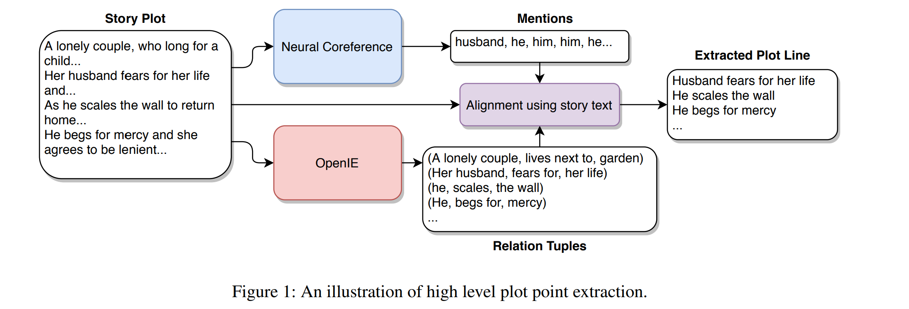

# Automated Storytelling via Causal, Commonsense Plot Ordering

通过因果关系、常识情节顺序自动讲故事

## abstract

soft causal relations: causal relations inferred from commonsense reasoning

C2PO: Casual,Commonsense Plot Ordering,一种叙事生成方法，通过因果关系、常识情节排序来实现这一概念（soft casual relation）

Using humanparticipant protocols, we evaluate our system against baseline systems with different commonsense reasoning approaches and inductive biases to determine the role of soft causal relations in perceived story quality. 使用人类参与者协议，我们根据具有不同常识推理方法和归纳偏差的基线系统评估我们的系统，以确定软因果关系在感知故事质量中的作用。

 probe the interplay of how changes in commonsense norms across storytelling genres affect perceptions of story quality.探讨不同叙事体裁的常识规范变化如何影响对故事质量的看法的相互作用。

## 1	Introduction

许多先前的情节生成方法都依赖于符号规划(symbolic planning)——以谓词前提和后置的形式直接推理因果支持 -条件匹配。 虽然这些系统可以保证故事事件之间的因果关系，但这些方法也需要广泛的领域知识工程和有限的事件和人物词汇。

自动生成故事的ML方法可以从现有故事或情节摘要的语料库中学习讲故事和领域知识。 这在理论上使他们能够克服知识工程瓶颈。 然而，基于神经语言模型的自动故事生成方法学习单词、句子和事件之间的概率关系，因此难以对动作和事件之间的因果关系进行建模。 此外，故事需要在体裁和常识规范方面保持一致。

### In this paper:

- 将故事生成问题视为情节填充，从源中提取情节点的轮廓，然后对其详细说明。
- 引入软因果关系的概念，其中故事事件之间的因果蕴涵不需要在逻辑上严格一致，而是借鉴了人们对一个事件是否倾向于在另一个事件之前或之后的日常常识的理解。
- 在C2PO系统中使用软因果关系填充情节来生成叙事——创建一个可能的故事延续的分支空间，从 COMET 常识推理模型中迭代地提取常识因果推理。 最后，一旦空间——a plot graph——被构建，我们在空间中搜索完整的序列。
- 根据具有不同用途的常识推理和归纳偏差的基线文本填充系统评估 C2PO，以确定软因果关系对故事质量感知的作用。 我们选择了两个不同类型的故事语料库：现实世界的神秘故事，如福尔摩斯——以通常与日常常识规范一致而闻名，以及儿童童话，如汉塞尔和格莱特——通常打破常识预期的故事。 通过这些研究，我们进一步探讨了更广泛的问题，即不同叙事体裁的常识规范(commonsense norms)的变化如何影响对故事质量的看法。

## 2	Soft Casual Relations

### Hard Casual Relation

*a character John cannot shoot Xavier if John is not in possession of a gun and the two characters are physically co-located.*

某些世界状态的改变是非法的

### Soft Casual Relation

- 由假定读者的信念来调节

- 软因果关系是因果关系——通常是叙事中的逻辑结构——以读者的信念为中介。它从读者的角度而不是从作者的角度提供了事件的因果排序。

- 对两个非互斥标准的合理预期：
  - 需要某些活动来实现角色的目标：读者试图通过追踪因果关系作为促成因素来理解事件“为什么”发生——某些事件 y 不可能发生，除非某些先前的事件 x 发生。
  - 某些活动是为了追求未来的目标：读者试图通过跟踪和预测角色目标层次结构来理解事情发生的“原因”。

##### 硬因果关系和软因果关系的主要区别在于通过常识推理对因果关系的期望。

### Commonsense Knowledge

关于世界如何运作的一组共同共享的知识。它使我们能够对采取某些行动方案时会发生的事情形成预期，并推断过去可能发生的事情。

### Commonsense Reasoning

将常识知识应用于特定的上下文

常识推理可用于推断角色达到某种状态可能需要发生的事情（软启动）——以及基于目前发生的事情，合理的下一步行动是什么（软目标）

### COMET

模拟假定读者的常识知识。

COMET 是一种基于转换器的语言模型，专为常识推理而设计，并在 ATOMIC 上进行训练。ATOMIC 是一个数据集，其中包含 877k 个与日常常识推理相关的信息实例，这些实例以类型化的 if-then 关系与变量的形式存在。 ATOMIC 被组织成不同的关系类型，例如“需要”、“想要”、“属性”和“效果”。我们专门使用“想要”和“需要”的关系。使用想要关系的原因的一个例子如下，“如果 X 试图逃脱，那么 X 想要自由。”同样，使用需求关系的效果示例是，“如果 X 缩放墙壁，那么 X 需要知道如何缩放墙壁。”
硬因果关系和软因果关系之间的主要区别是通过常识推理对因果关系的期望的想法。硬因果关系需要验证和满足命题，如论文中给出的例子 - 如果约翰没有枪或他们不在同一地点，约翰就不能射击泽维尔。这里的一个软因果关系是读者相信约翰不喜欢泽维尔并想与他战斗，因此他想要武器。枪是武器，因此约翰有可能需要武器来对抗泽维尔。

## 3	C2PO

C2PO 首先从给定的文本故事情节 S 中提取一组高级情节点，然后在每个高级情节点之间生成一组分支事件。 通过遍历连接每个生成的子图生成的整体情节图，得到最终的故事。

### 3.1	情节提取

使用[共指消解](https://blog.csdn.net/u010551621/article/details/52811727)(目的在于自动识别表示同一个实体的名词短语或代词，并将他们归类) 和信息提取来识别跟随单个字符的一组情节点。

- 首先，我们使用预训练的神经共指解析模型提取所有共指集群。可以有多个这样的集群，每个集群都包含故事中属于单个可能角色的所有提及。我们随机选择这些集群之一。让 M = {m1, m2, ..., mn} 表示这个集群。同时，我们还使用 OpenIE 从故事文本中提取了一组 <subject、relation、object> 三元组R。一旦我们获得了一个角色的提及集和故事的三元组，我们将它们对齐，尝试根据单个角色在其中的角色级别位置找到与单个角色相关的三元组 P ⊂ R 的子集原始故事文本。神经共指模型和 OpenIE 都是信息检索系统，因此我们可以识别原始故事文本中检索到的信息的字符级偏移或位置。让 pos(·) 成为一个可以做到这一点的函数。
- 情节点集是 结果是一系列关系元组，其中角色是三元组的主要主题，按它们首次出现在原始故事文本中的时间排序。将每个三元组连接在一起会产生一个主-关系-客短语，我们称之为情节点。

### 3.2	Plot Graph Generation

为每对相邻的情节点（pi , pi+1), i ∈ {1, .., n − 1} 然后按照情节点首先出现在 P 中的顺序链接在一起，形成整个故事的情节图。

在相邻的情节点 p1、p2 之间生成情节图：

- 从 p1 开始，我们使用 COMET 来生成故事中的候选下一个事件。wants关系表示一个直接的前因——一个角色有一个想要的东西，因此执行一个动作。我们递归查询 COMET 以从 p1 开始 n 次生成 k 个候选事件；令其为 $g^{f}$ 。
- needs关系表示向后启用——一个角色需要一些真实的东西来做一个动作。我们递归查询 COMET 以从 p2 向后 n 次生成 k 个候选事件；令其为 $g^b$ 。这为我们提供了两个有向无环图。
-  $g^f$和$g^b$中的关系的加权与 COMET 为每个推理产生的似然分数成正比。
- 下一步是寻找链接$g^f$和$g^b$的最佳方式，并计算到达节点 u ∈ $g^f$ 查看所有节点 ∀v ∈$g^b$的概率。令 $Pr^{needs}(u|v)$ 是 COMET 在needs关系下，以 $e_1$ 为条件,确定的事件 $e_2$ 的发生概率，而 $Pr^{wants}(v|u)$ 是相同但在wants关系下。我们将这个链接的权重定义为：

$a^{wants}_u$和$a^{needs}_v$是归一化常数（normalization constants）

在这里，我们将它们设置为生成单词“to”的概率，这是两种关系类型共有的 ATOMIC 单词。 对所有节点重复这个过程，直到我们找到一组最佳链接。

- 最后，我们将整个情节点序列的情节图链接在一起： 。其中 p1, p2 在 P 中是相邻的。一个故事可以是 通过图形从第一个情节点p1 到最后一个 pn 的随机游走生成。 所有随机游走都保证在 pn 终止，因为 $g^b _{pn}$ 是通过从 pn 向后分支构造的。 同样，每个中间情节点 p2...pn−1 是 G 中所有步行必须经过的节点。

## 5	Experiments

评估具有两种类型的故事数据集——神秘故事和童话故事

数据以 8:2 的比例划分为训练和测试分割，训练分割用于训练 C2PO 和两个基线模型（如下所述）。从测试集中的每个类型中随机选择 10 个故事集，并按照第 4 节所述提取高级情节点。对于每个模型、每组高级情节点和每个类型，我们生成三个不同的故事总共 3×10×2×3 = 180 个故事。我们为模型、情节点集和类型的每个组合生成三个故事，以解释由于相同的高级情节可以产生的故事的差异C2PO 的分支性质以及基线输出的差异。

# 总结

这篇论文介绍了soft casual relations这个概念和C2PO的故事生成系统。

软因果关系是指由读者的beliefs来调节的因果关系，从读者的角度提供了事件的因果排序。

两个非互斥标准的合理预期：

- 需要某些活动来实现角色的目标：读者试图通过追踪因果关系作为促成因素来理解事件“为什么”发生——某些事件 y 不可能发生，除非某些先前的事件 x 发生。
- 某些活动是为了追求未来的目标：读者试图通过跟踪和预测角色目标层次结构来理解事情发生的“原因”。

然后根据这两个预期，将常识知识应用于特定的上下文形成常识推理，来推断角色达到某种状态可能需要发生的事情（软启动）——以及基于目前发生的事情，合理的下一步行动是什么（软目标）

与之对立的是硬因果关系，硬因果关系需要验证和满足命题

然后引入专为常识推理而设计的COMET的语言转化模型，专门使用“wants”和“needs”的关系。使用想要关系的原因的一个例子如下，“如果 X 试图逃脱，那么 X 想要自由。”同样，使用需求关系的效果示例是，“如果 X 缩放墙壁，那么 X 需要知道如何缩放墙壁。”

最后讲了C2PO生成故事的过程。

首先从给定的文本故事情节 S 中提取一组高级情节点，这个情节点然后在每个高级情节点之间生成一组分支事件。 通过遍历连接每个生成的子图生成的整体情节图，得到最终的故事。
