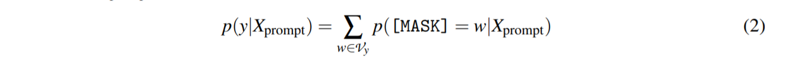
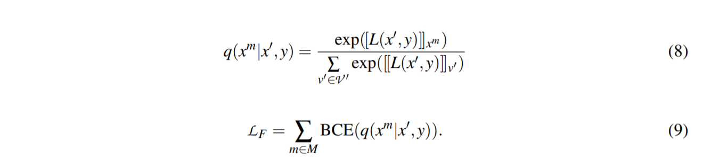

# Differentiable Prompt Makes Pre-trained Language Models Better Few-shot Learners

可区分提示使预训练语言模型更好

## Abstract

大规模预训练语言模型通过展示作为少样本学习者的卓越能力，对自然语言处理做出了重大贡献。然而，它们的有效性主要取决于模型参数的缩放和快速设计，阻碍了它们在大多数实际应用中的实现。

本研究提出了一种名为 DifferentiAble pRompT (DART) 的新型**可插拔、可扩展**和高效方法，该方法可以将小型语言模型转换为更好的少样本学习器，而无需任何提示工程。这种方法背后的主要原理涉及将**潜在的自然语言处理任务重新构建为预训练语言模型的任务，并通过反向传播对提示模板和目标标签进行差异化优化**。

此外，所提出的方法可以是：

- 插入任何预先训练的语言模型； 
- 扩展到广泛的分类任务。

对标准 NLP 任务的综合评估表明，所提出的方法实现了更好的少拍性能(few-shot performance)。

## 1	Introduction

##### (1)	存在的问题

大规模预训练模型面临小样本学习([few-shot learning](https://zhuanlan.zhihu.com/p/61215293))的挑战。

##### (2)	已有的解决方法

一种新型微调方法，可以为较小的语言模型 (LM) 配备少量功能：通过完成完形填空任务，将预训练的 LM 直接用作预测器，它将下游任务视为masked language modeling problem。这些提示可用于微调，为分类器提供额外的任务信息，尤其是在低数据情况下。

难点：获得优化的提示模板和目标标签标记并非易事。

##### (3)	本文提出的方法

DART，可区分提示的微调方法。关键思想是利用语言模型中的一些参数（未使用的标记）作为模板和标签标记，并使用[反向传播](https://blog.csdn.net/bitcarmanlee/article/details/78819025)在连续空间中优化它们。

本文提出了一个两阶段的优化算法，首先是学习模板和标签，然后是整体参数。进一步引入了一个辅助流畅性约束对象来确保提示嵌入之间的关联。

## 2	Related Work

**Language Modeling Prompt**：最近在该领域进行的研究一直专注于自动搜索提示。

- 提出了 PET，它将 NLP 任务重新制定为完形填空式问题并执行基于梯度的微调。
- 在微调期间使用更密集的监督对象改进 PET。
- 建议使用 AUTOPROMPT 为基于梯度引导搜索的各种任务创建提示。
- 提出了一种称为 PTR 的方法，它利用逻辑规则为多类文本分类构造带有子提示的提示。
- 将潜在的 NLP 任务重新表述为一个蕴涵任务，然后用少量样本对模型进行微调。
- 提出了一种通过校准将外部知识图整合到语言表达器中的方法。
- 提出了 LM-BFF——更好的语言模型的少量微调，它利用 T5 [35] 在词汇表中生成模板和搜索标签标记。

 然而，使用生成模型和带有验证的标签搜索是计算密集型的。此外，由于神经网络的连续性，对离散空间的快速搜索是次优的。

为了克服这些限制：

- 提出了 P-tuning，它采用了由 LSTM 学习的可训练的连续提示嵌入。
- 提出了一种称为 OPTIPROMPT 的有效连续方法来优化事实探查的提示。
- 提出前缀调整，它保持语言模型参数冻结，但为自然语言生成任务优化了一个小的连续任务特定向量。
- 提出了一种学习“软提示”的机制，以调节冻结语言模型以执行下游任务。

然而，这些方法仍然需要优化外部参数（例如 P-tuning 中的 LSTM）并且容易出现复杂的标签空间。

## 3	Backgroud

### 3.1	Language Model Prompt

设 $X_in = \{x_1, x_2,..., x_L\}$ 是一个句子，其中 $x_i$ 是输入句子中的第 i 个token，L 是token的数量。 具体来说，$X_in$ 被转换为一个固定的标记序列 $\tilde{x_{in}}$，然后映射到一个隐藏向量序列 $\{h_k ∈ \mathbb{} d\}$。 给定输入序列 $\tilde{x_{in}} = [\mathbf{CLS}]X_{in}[\mathbf{SEP}]$，传统的微调方法利用 [CLS] 嵌入（例如，MLP 层）上的通用头层来预测输出类。 对于基于提示的方法，特定任务的模式字符串（模板 $\mathcal{T}$ ）旨在诱导模型生成对应于给定类（标签标记 $\mathcal{M} (Y)）$的文本输出——我们将这两件事一起称为一个提示。 具体来说，包含一个 [MASK] token的 $X_prompt$ 直接将 MLM 输入分配给以下任务：

 

当提示输入MLM时，模型可以得到候选类的概率分布$p([MASK]|(X_{prompt})$，y∈Y为：

 

其中 w 表示第 y 类的第 w 个标签标记。

## 4	Our Approach

### 4.1	Motivation

少样本学习者的预训练语言模型的改进，需要最佳提示。

### 4.2	Differentiable Template Optimization

给定模板：$\mathcal{T}=\{[\mathbf{T}_{0:i}],[\mathbf{MASK}],[\mathbf{T}_{i+1:j}]\}$，满足$[\mathbf{T}_i]\in\mathcal{V}$，并将模板映射为：

DART 将$ [\mathbf{T}_i]$ 视为伪标记并将模板映射如下：

其中$ h_i(0 ≤ i ≤ j) $是可训练的参数。 可微模板优化可以获得超出原始词汇表$\mathcal{ V}$ 的表达模板。 最后，模板$h_i$ 通过以下方式进行了差异优化：

提示嵌入的值 $h_i$ 必须相互依赖而不是独立。

### 4.3	Differentiable Label Optimization

基于提示的微调需要填写一个单词，并将被屏蔽的单词预测映射到一个语言器，生成一个类（即“是”：真。“否”：假）。对于每个类 $c ∈ Y$，之前的方法估计初始 L 在前 k 个词汇词的修剪集$\mathcal{ V}^ c ⊂V $上的条件似然。

然而，蛮力标签搜索：（1）计算量大且繁琐，因为 $\mathcal{D}_{dev}$ 通常非常大，需要多轮评估。 (2)随着类数的增加，可扩展性差（很多分类数据集有100多个类），搜索次数可能是$k^C$（C代表类的总数），这是指数级的，因此难以处理。此外，类的标签包含丰富、复杂的语义知识，一个离散的标记可能不足以表示这些信息。

 具体来说，对于标签 $Y = \{Y_1,Y_2,..,Y_m\}$，不同于之前将类type  $Y_i$ 转换为可变数量的标签标记 $\{...,v_1,..,v_k ,. ..\}$，DART 将 $Y_j$ 映射到一个连续的词汇空间：

其中$\mathcal{ M }$是模板中可训练嵌入的数量。 为避免优化任何外部参数，将 $\{h_1,...,h_m,..,h_{m+n}\}$ 替换为 $\mathcal{V}$ 中未使用的标记以生成$\mathcal{V}'$。

### 4.4	Training Objectives

类别区分目标 $\mathcal{L}_C$ 和流畅性约束目标 $\mathcal{L}_F$。

##### (1)	class discrimination object

其中 CE 是交叉熵损失函数，$\mathcal{L}_C$ 代表类别区分损失。

##### (2)	Fluency Constraint Object

输入句子中的一个 token 被随机屏蔽，并进行屏蔽语言预测。 $x$ 和 $x'$ 分别是原始序列和掩码序列。 设 $x^m$ 为在 $x'$ 中被屏蔽的目标标记，$P(x^m|x' , y)$ 最大化如下：

通过优化$\mathcal{L}_F$ ，语言模型可以获得更好的上下文表示，模板标记之间具有丰富的关联。 我们有以下训练对象：

### 4.5 Comparison to Previous Prompt-tuning Approaches

## 5	Experiments

### 5.1 Dataset Statistics

对 15 个 NLP 任务进行了全面研究，涵盖了情感分析、自然语言推理、释义、句子相似性、关系提取和事件提取。评估包括 10 个流行的句子分类数据集。

### 5.2	Settings

- 使用Pytorch实现模型。

- 使用与LM-BFF相同的设置：使用一组固定的种子Sseed测量每个任务的五个不同采样Dtrain的平均性能。

- 使用AdamW作为优化器。
- 我们使用 RoBERTa-large 对分类任务进行实验，以便与 LM-BFF 进行公平比较。 
- 使用uncased BERT-large [10] 来进行关系提取数据集。

### 5.3	Main Result

### 5.4	Ablation Study

消融研究

- 在缺少任何一个模块（即流畅性约束对象、可微模板或可微标签）的情况下，DART 表现出性能下降，这表明所有模块都是有利的。
- 可微标签优化对性能更敏感，并且对 DART 非常有益，尤其是对于低资源设置。

### 5.5	Analysis and Discussion

##### (1)	Can DART Applied to Other Pre-trained LMs?

DART 可以应用于其他预训练的语言模型吗？

使用 GPT-2 介质的 DART 比传统的微调方法产生更好的性能。此外，论文注意到使用 GPT-2-medium 的 DART 可以达到与 BERT-large 相当的性能。

##### (2)	What Exactly Optimized Prompt is?

什么是完全优化提示？

作者进行最近邻词汇嵌入搜索，将 $\mathcal{V}$ 中的 Top-3 优化伪标签标记投射到可读的自然语言中。

使用 t-SNE [43] 和标准化来可视化 Wiki80 数据集上的标签。

##### (3)	DART v.s. Conventional Fine-tuning

- DART 没有优化任何新参数；然而，传统的微调应该在 [CLS] 嵌入上学习一个明确的分类器，这在低数据情况下可能会失败。 
- DART 具有与大规模语言模型预训练相同的任务设置，并且对于下游分类任务具有较小的理论上限。

##### (4)	Limitations

当任务语料库的分布与预训练语料库的分布不同时，DART可能会失败。此外，DART还显示了与超参数相关的不稳定性， NLP 中少样本学习的波动性。

## 6	Conclusion and Future Work

本文介绍了 DART，这是一种简单而有效的微调方法，可改进快速学习预训练语言模型。与传统的微调方法相比，所提出的方法可以在少拍场景中产生令人满意的改进。所提出的方法也可用于其他语言模型，并可扩展到其他任务，例如意图检测。直观地说，本研究中获得的结果可用于激发 NLP 小样本学习的两个未来研究方向：

- 将所提出的方法扩展到半监督设置以进一步利用未标记数据； 
- 将所提出的方法扩展到少拍终身学习，而提示必须通过自适应任务进行优化。

